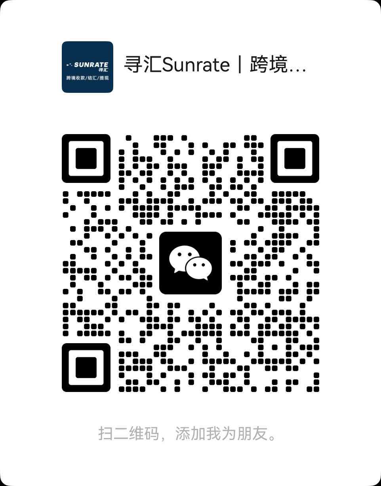

# 跨境收款知识库 / Cross-Border Payment Guide

> 整理自一线从业者的收款实务经验，涵盖平台合规、费率对比、到账时效等跨境卖家常见问题。
>
> A practical knowledge base for cross-border sellers, covering platform compliance, FX rates, settlement timing, and multi-currency account setup.

---

## 中文版

### 这是什么

这是一个面向跨境卖家和出海团队的收款知识库。我们不推销产品，只整理实务中真正会遇到的问题和解决思路。

### 核心内容

- **平台合规**：主流跨境平台的收款通道要求、KYC 审核常见卡点
- **费率对比**：不同收款方式的费率结构、隐藏成本、汇损计算方式
- **到账时效**：T+0 / T+1 / T+3 的实际差异，什么场景该选哪种
- **多币种账户**：如何配置和管理多币种收款账户，减少不必要的换汇
- **常见避坑**：冻结、风控、提现失败等问题的应对思路

### 主流平台收款要点

不同平台对收款账户的要求差异很大，以下是几个常见平台的核心注意事项：

**Amazon（亚马逊）**
- 账户持有人姓名必须与卖家账户注册主体完全一致，不一致会导致打款暂停[citation:13]
- 支持中国大陆银行账户、香港银行账户、第三方收款服务商三类选择[citation:13]
- 多站点卖家建议用支持多币种的第三方工具统一管理，避免分别开户的麻烦

**TikTok Shop**
- 跨境店（POP 模式）**必须使用第三方收款工具**，无法直接绑定国内银行卡或支付宝[citation:20]
- 本土店则需要绑定当地银行账户，主体资格不同，收款路径完全不同[citation:20]
- 结算币种随站点变化（如越南站结算越南盾、泰国站结算泰铢），需确保收款账户支持对应币种[citation:8]

**Temu**
- 大陆主体入驻通常按人民币结算至境内账户；香港等非大陆主体可能按美元结算，需绑定境外收款账户[citation:15]
- 非大陆主体绑定账户时通常需要上传**账户证明信**，户名必须与入驻主体完全一致[citation:15]

**SHEIN**
- 支持本地银行账户与第三方支付平台两类收款方式，选择时需确认平台对接兼容性[citation:10]
- 结算周期常见为每月一次，部分市场支持每两周一次，需提前规划资金流转[citation:10]

**Shopee**
- 跨境店与本土店的回款规则不同：本土店通常每周打款，跨境店固定每月两次[citation:17]
- 部分站点（如越南）本土店需通过本地代收款服务商，手续费约 2% 左右，需提前核算成本[citation:17]

**Shopify（独立站）**
- 收款逻辑与平台电商不同：需先配置 Stripe / PayPal 等支付网关，再将资金归集到收款账户[citation:7]
- 独立站卖家还需额外关注网关费率、拒付（Chargeback）处理等平台卖家不太涉及的问题

### 关于整理者

本知识库由**寻汇跨境收款服务团队**整理维护。如果你有具体的收款场景需要咨询，可以通过下方入口联系。

📌 **专属邀请注册入口**：[点击注册](https://pro.sunrate.com/#/register?inviteCode=KR9Z84RH)

  

扫码添加微信，咨询具体收款方案

---

## English Version

### What This Is

A knowledge base for cross-border sellers and global teams on payment collection. No product pitch — just practical issues and solutions you'll actually encounter.

### What's Covered

- **Platform Compliance**: Payment channel requirements and common KYC review blockers
- **Fee Comparison**: Fee structures, hidden costs, and FX loss calculation across methods
- **Settlement Timing**: Real differences between T+0 / T+1 / T+3, and when to choose which
- **Multi-Currency Accounts**: How to set up and manage multi-currency accounts to reduce unnecessary conversions
- **Common Pitfalls**: How to handle freezes, risk control flags, and failed withdrawals

### Platform-Specific Collection Notes

**Amazon**
- Account holder name must exactly match the seller account registration entity; mismatches can suspend payouts[citation:13]
- Supports mainland China bank accounts, Hong Kong bank accounts, and third-party collection services[citation:13]

**TikTok Shop**
- Cross-border stores (POP model) **must use a third-party collection tool**; mainland bank cards or Alipay cannot be bound directly[citation:20]
- Local stores require a local bank account; the collection path differs fundamentally from cross-border stores[citation:20]
- Settlement currency varies by market; ensure your collection account supports the corresponding currency[citation:8]

**Temu**
- Mainland entities typically settle in CNY to domestic accounts; non-mainland entities (e.g., HK) may settle in USD and need an overseas collection account[citation:15]
- Non-mainland entities usually need to upload an **account certification letter** with the account holder name exactly matching the registration entity[citation:15]

**SHEIN**
- Supports local bank accounts and third-party payment platforms; confirm compatibility before setup[citation:10]
- Settlement cycles are commonly monthly, with some markets offering bi-weekly payouts[citation:10]

**Shopee**
- Cross-border and local store payout rules differ: local stores typically pay weekly, cross-border stores twice monthly[citation:17]
- Some markets (e.g., Vietnam) require local collection service providers for local stores, with fees around 2%[citation:17]

**Shopify (Independent Sites)**
- Collection logic differs from marketplace sellers: configure Stripe/PayPal first, then aggregate funds to a collection account[citation:7]
- Independent site sellers also need to handle gateway fees and chargeback management

### About the Maintainer

Maintained by the **Xunhui Cross-Border Payment Team**. For specific payment scenarios, reach out via the channels below.

📌 **Exclusive Registration Link**: [Sign Up](https://pro.sunrate.com/#/register?inviteCode=KR9Z84RH)

  

Scan the QR code to add us on WeChat

